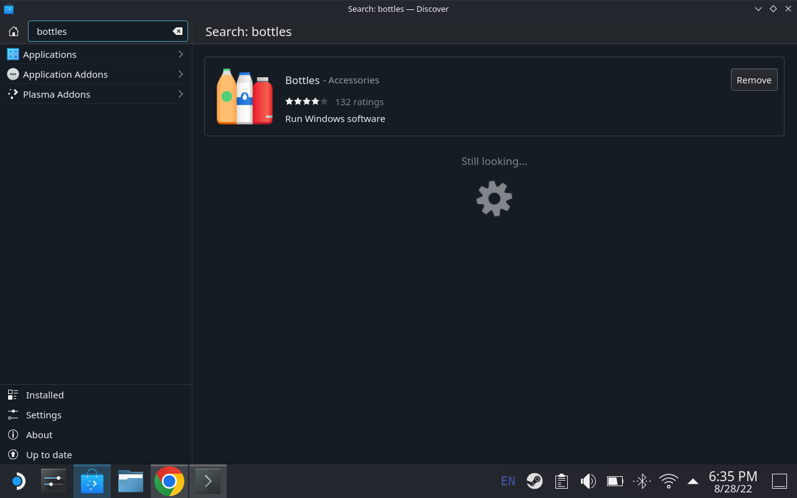
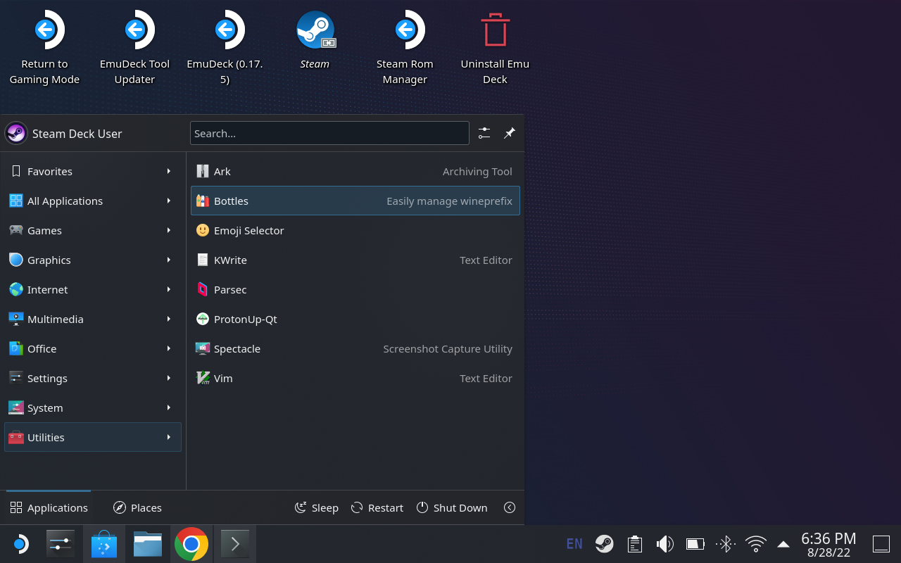
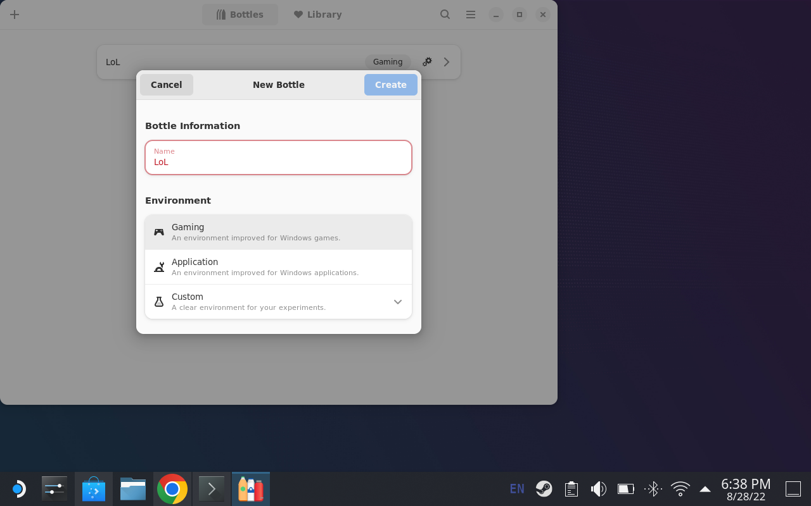

# This guide is for installing League of Legends on the Steam Deck

Go to the discover store and install bottles

Load bottles from Utilities/Bottles

Add Bottle with gaming selection and name it exactly LoL (2 capital L's, 1 lowercase 0, and no spaces)

